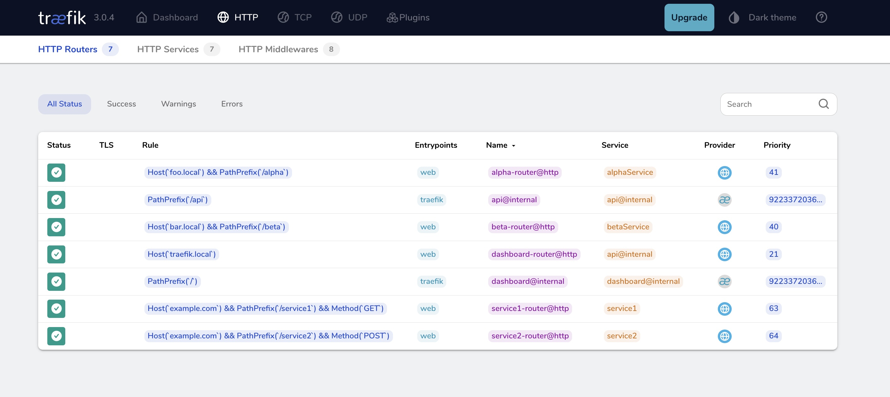

# Traefik Dynamic HTTP Provider Demo

This repository demonstrates an experimental approach to creating a clean REST API interface in front of n8n webhooks using Traefik's HTTP provider. The goal is to transform verbose webhook URLs into a structured REST API while laying groundwork for webhook autodiscovery.

## Motivation

n8n workflows typically expose webhooks with auto-generated or verbose URLs that don't follow REST conventions. For example:

```
# Original n8n webhooks
https://n8n.company.com/webhook/order-created
https://n8n.company.com/webhook/order-updated
https://n8n.company.com/webhook/order-status
```

This experiment uses Traefik to transform these into a clean REST API:

```
# Clean REST API endpoints
GET    /api/orders          # Lists orders (maps to order-list webhook)
POST   /api/orders          # Creates order (maps to order-created webhook)
GET    /api/orders/{id}     # Gets order details (maps to order-status webhook)
PUT    /api/orders/{id}     # Updates order (maps to order-updated webhook)
```

## Overview

The setup demonstrates how to:
1. Use Traefik's HTTP provider for dynamic routing configuration
2. Transform webhook endpoints into REST API endpoints
3. Handle different HTTP methods for the same resource
4. Provide consistent API response headers
5. Set foundation for webhook autodiscovery

### Example Configuration

```yaml
# Example of mapping REST endpoints to n8n webhooks
"http": {
  "routers": {
    "orders-create": {
      "rule": "Host(`api.company.com`) && PathPrefix(`/api/orders`) && Method(`POST`)",
      "service": "n8n-order-creation",
      "middlewares": ["auth-check", "standard-headers"]
    },
    "orders-update": {
      "rule": "Host(`api.company.com`) && Path(`/api/orders/{id}`) && Method(`PUT`)",
      "service": "n8n-order-update",
      "middlewares": ["auth-check", "standard-headers"]
    }
  }
}
```

## Dashboard

Monitor your API routes through the Traefik dashboard:



Access the dashboard at `http://localhost:8080` after starting the services.

## Implementation Details

The repository includes two implementations to experiment with different approaches:

### OpenResty Version (Main)
Uses OpenResty to simulate dynamic backend responses, useful for:
- Testing different REST API patterns
- Simulating n8n webhook responses
- Developing autodiscovery mechanisms

### Nginx Version (Alternative)
Provides a simpler static implementation for basic testing and proof of concept.

## Usage

```bash
# Clone and start the services
git clone https://github.com/hannes-sistemica/traefik-dynamic-http.git
cd traefik-dynamic-http
docker compose up -d

# Test endpoints
curl -v -X GET -H "Host: example.com" http://localhost:8081/service1
curl -v -X POST -H "Host: example.com" http://localhost:8081/service2
```

## Future: Webhook Autodiscovery

This setup lays the foundation for a webhook autodiscovery tool. The planned workflow:

1. n8n exposes a webhook inventory endpoint
2. Autodiscovery service queries n8n for available webhooks
3. Generates Traefik configuration mapping webhooks to REST endpoints
4. Updates Traefik's configuration via HTTP provider

```yaml
# Future autodiscovered configuration
"http": {
  "routers": {
    # Automatically generated from n8n webhook inventory
    "discovered-order-api": {
      "rule": "Host(`api.company.com`) && PathPrefix(`/api/orders`)",
      "service": "n8n-mapped-service",
      "middlewares": ["auto-headers"]
    }
  }
}
```

## Architecture

```
                                 ┌─────────────────┐
                                 │                 │
                           ┌────►│    Service 1    │
                           │     │   (OpenResty)   │
                           │     └─────────────────┘
┌──────────┐      ┌────────┤
│          │      │        │     ┌─────────────────┐
│ Traefik  │──────┤        │     │                 │
│          │      │        ├────►│    Service 2    │
└──────────┘      │        │     │   (OpenResty)   │
     ▲            └────────┤     └─────────────────┘
     │                     │
     │                     │     ┌─────────────────┐
┌──────────┐               │     │                 │
│  Config  │               └────►│    Service 3    │
│  Server  │                     │   (OpenResty)   │
└──────────┘                     └─────────────────┘
```

## Security Considerations

For production use, consider:
- HTTPS for all endpoints
- JWT validation
- Rate limiting
- Request validation
- Access logging

## Development Status

This is an experimental project focused on:
1. Proving the concept of REST API facade over webhooks
2. Testing dynamic configuration approaches
3. Developing patterns for webhook autodiscovery
4. Creating maintainable API structures

Feedback and contributions are welcome as we explore this approach to webhook management and API design.